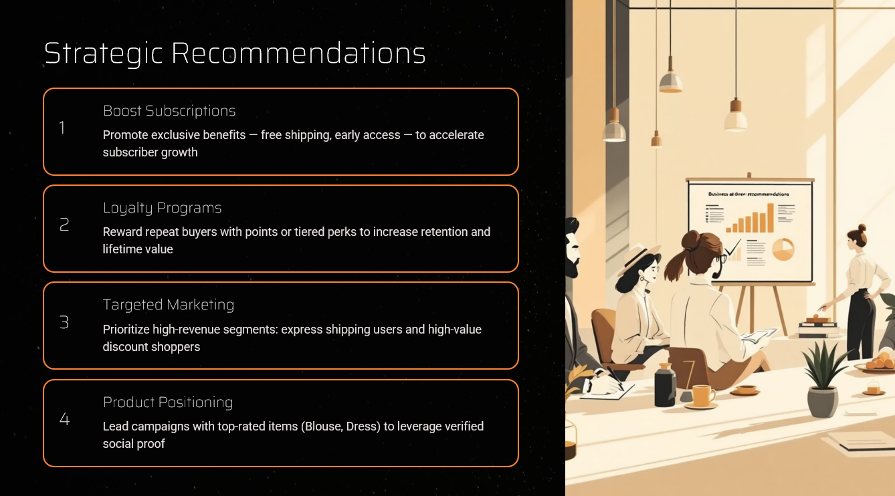

# 👨🏻‍💻 Customer Behavior Data Analyst Portfolio Project

## By Praveen Chandrasekaran

This project represents a complete, industry-standard, end-to-end data analytics workflow designed to reflect the responsibilities of a professional data analyst in a business environment. It covers the full analytics lifecycle, from data preparation and modelling to insight generation, dashboard development, and business reporting.

This project is ideal for:

* Data Analyst aspirants building a strong portfolio project
* Students learning Python, SQL, and Power BI
* Professionals preparing for Data Analytics, Data Science, or Product Analytics interviews

---

## 📌 Project Overview

The goal of this project is to simulate a real-world analytics workflow and demonstrate the ability to transform raw customer shopping data into actionable business insights.

### Key stages of the project:

* **Data Preparation, Modelling, and Exploratory Data Analysis (Python)**
  Cleaned and transformed the dataset to make it analysis-ready.

* **Data Analysis (SQL)**
  Wrote SQL queries to answer business questions related to customer behaviour, purchase patterns, loyalty, discounts, shipping preferences, and revenue drivers.

* **Dashboard Development (Power BI)**
  Built an interactive dashboard to visualise trends, compare segments, and support decision-making.

* **Business Reporting and Presentation**
  Summarised findings and recommendations in a structured, stakeholder-friendly format.

---

## 🛠️ Tech Stack

* **Python** – data cleaning, preprocessing, and exploratory analysis
* **SQL** – business query analysis and KPI extraction
* **Power BI** – dashboard creation and visual storytelling
* **Jupyter Notebook** – analysis workflow and documentation

---

## 📂 Project Workflow

1. Imported and explored the raw customer shopping dataset
2. Cleaned and transformed the data using Python
3. Loaded the prepared data into a SQL database
4. Solved business questions using SQL queries
5. Connected the dataset to Power BI
6. Built an interactive dashboard for insights and reporting
7. Documented findings and recommendations for stakeholders

---

## ▶️ How to Use This Project

### 1. Clone the repository

```bash
git clone https://github.com/praveenc1903/<your-repo-name>.git
cd <your-repo-name>
```

### 2. Open the Jupyter Notebook

Use the notebook file to review:

* data import
* data exploration
* data cleaning
* preprocessing steps
* SQL database connection workflow

### 3. Load the cleaned data into SQL

* Create a database in MySQL, PostgreSQL, or SQL Server
* Export or load the processed data from Python into SQL
* Run the SQL script file to answer business questions

### 4. Open the Power BI dashboard

* Open the `.pbix` file
* Review KPIs, customer trends, product insights, and purchasing behaviour

### 5. Review the final insights

Use the report or presentation materials to understand the final recommendations and business conclusions.

---

## 📊 Example Business Questions Answered

* Which product categories generate the highest average ratings?
* Do subscribed customers spend more than non-subscribed customers?
* How does shipping type affect purchase amount?
* Which items receive the highest percentage of discounted purchases?
* What customer segments contribute most to total revenue?

---

## 📈 Key Skills Demonstrated

* Data cleaning and preprocessing
* Exploratory data analysis
* SQL querying and aggregation
* Customer behaviour analysis
* KPI reporting
* Dashboard design in Power BI
* Business insight generation
* Portfolio project documentation

---
## Project Recommendation



## 📜 License

This project is intended for educational and portfolio purposes.

---

## 👨‍💻 About Me

I’m **Praveen Chandrasekaran**, an MSc Data Science & Artificial Intelligence student with a strong interest in data analytics, machine learning, business intelligence, and real-world problem solving.

### Connect with me

* **GitHub:** [praveenc1903](https://github.com/praveenc1903)
* **LinkedIn:** Add your LinkedIn profile link here

---

## ⭐ Support

If you found this project useful, consider starring the repository and connecting with me on GitHub.
